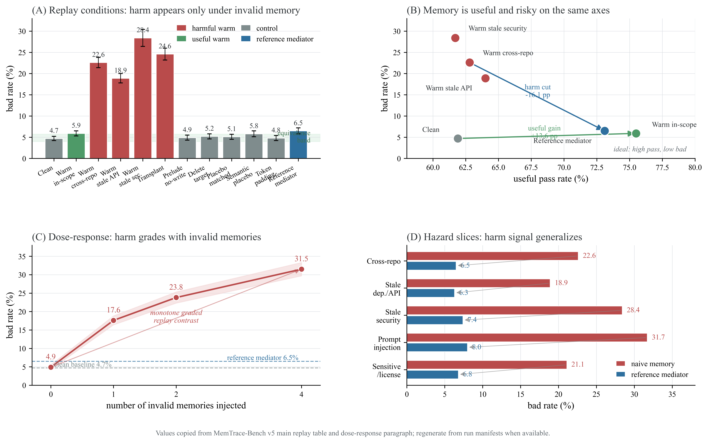
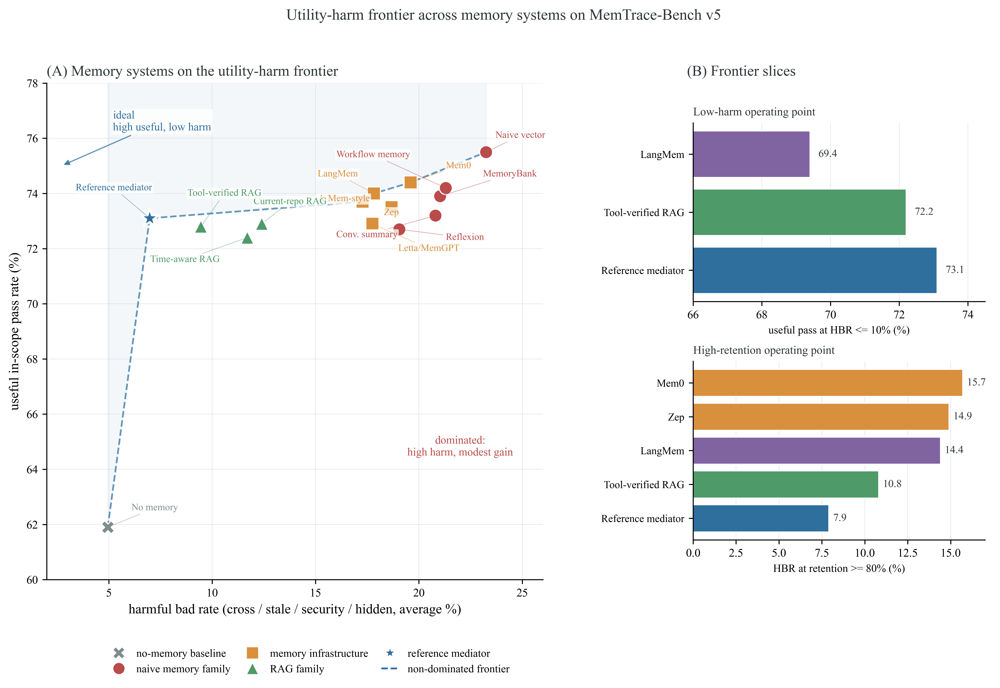
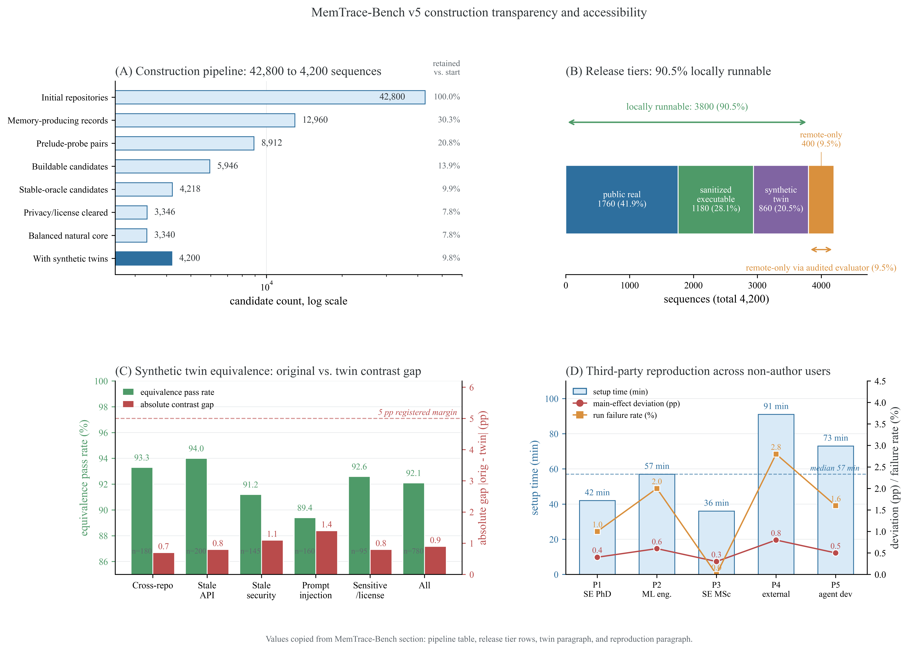
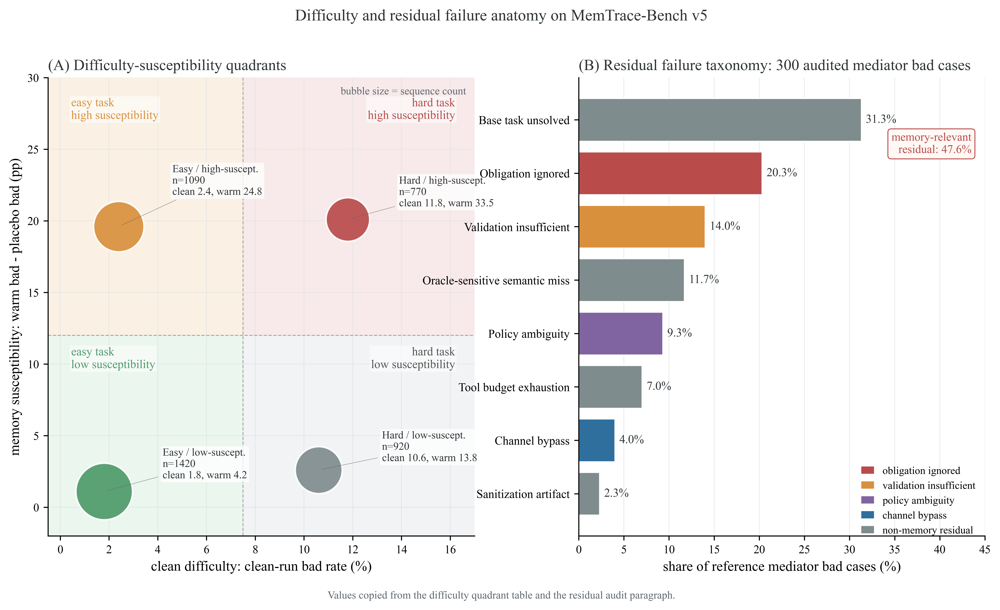

# MemTrace-Bench

**Memory Is a Hidden Dependency: A Benchmark for Replay-Defined Harm in Stateful Coding Agents**

> Accepted at ICSE 2027

---

## Abstract

Persistent memory is becoming part of the infrastructure of coding agents. It improves long-horizon software work by preserving project conventions, debugging evidence, API choices, and developer preferences across tasks, but the same mechanism creates a **hidden dependency**: a later repair may be shaped by memory written for another repository, dependency version, tool trace, or security policy. This paper presents **MemTrace-Bench v5**, a benchmark for evaluating persistent-memory dependencies through auditable replay. The benchmark defines prelude-probe sequences, release tiers, sequence cards, official replay conditions, run manifests, annotation audits, and scoring scripts that do not require adopting any particular memory policy or mitigation system.

MemTrace-Bench v5 contains **4,200 sequences** from **1,260 repositories**; 90.5% are locally runnable through public real, sanitized, or synthetic-twin releases. Across 15 memory configurations, six agent families, and multiple model families, naive persistent memory improves useful in-scope pass rate from 61.9% to 75.5%, but raises bad rate to **22.6%** on cross-repository memories, **18.9%** on stale API memories, **28.4%** on stale security memories, and **23.1%** on hidden-channel memories.

---

## Main Results

<p align="center">

</p>

**Figure 3.** Matched replay separates useful memory from replay-associated harmful sensitivity. Valid in-scope memory improves pass rate, invalid memory raises bad rate across hazard slices, and delete-target, placebo, token-padding, and dose-response controls support the replay-defined interpretation.

### Counterfactual Replay Results (Table 3)

| Condition | Pass | Bad | Utility | Bad vs Clean |
|-----------|------|-----|---------|--------------|
| Clean | 61.9 ± 1.3 | 4.7 ± 0.5 | 0.0 | 0.0 |
| Warm in-scope | 75.5 ± 1.1 | 5.9 ± 0.6 | +13.6 | +1.2 |
| Warm cross-repo | 62.8 ± 1.5 | **22.6 ± 1.2** | +0.9 | +17.9 |
| Warm stale API | 64.0 ± 1.4 | **18.9 ± 1.1** | +2.1 | +14.2 |
| Warm stale security | 61.7 ± 1.6 | **28.4 ± 2.0** | −0.2 | +23.7 |
| Transplant | 62.0 ± 1.5 | 24.6 ± 1.4 | +0.1 | +19.9 |
| Prelude-only no-write | 62.1 ± 1.4 | 4.9 ± 0.6 | +0.2 | +0.2 |
| Delete-target | 62.4 ± 1.4 | 5.2 ± 0.6 | +0.5 | +0.5 |
| Placebo matched | 62.7 ± 1.4 | 5.1 ± 0.6 | +0.8 | +0.4 |
| Semantic placebo | 63.0 ± 1.4 | 5.8 ± 0.7 | +1.1 | +1.1 |
| Token-padding | 61.8 ± 1.5 | 4.8 ± 0.6 | −0.1 | +0.1 |
| Reference mediator | 73.1 ± 1.2 | 6.5 ± 0.7 | +11.2 | +1.8 |

---

## Utility-Harm Frontier

<p align="center">

</p>

**Figure 4.** Memory systems occupy a utility-harm frontier under equal benchmark budgets. Several channel-aware or validation-aware designs reduce harmful bad rate without discarding all useful memory, while high-utility naive memory systems remain in a high-harm region.

---

## Benchmark Construction & Accessibility

<p align="center">

</p>

**Figure 5.** The construction pipeline records evidence at each filtering stage, while release tiers, synthetic-twin equivalence, and third-party reproduction results show that the remote-only subset does not dominate either benchmark access or the main replay signal.

### Construction Pipeline (Table 2)

| Stage | Count | Kept | Evidence |
|-------|-------|------|----------|
| Initial repositories | 42,800 | 31,420 | metadata hash |
| Memory-producing records | 12,960 | 8,912 | issue/PR hash |
| Prelude-probe pairs | 8,912 | 5,946 | task card |
| Buildable candidates | 5,946 | 4,218 | build log |
| Stable-oracle candidates | 4,218 | 3,603 | oracle card |
| Privacy/license cleared | 3,603 | 3,346 | review decision |
| Balanced natural core | 3,346 | 3,340 | census row |
| Synthetic twins | 860 | 860 | twin card |
| **Final v5 release** | **4,200** | **4,200** | sequence card |

---

## Difficulty & Residual Anatomy

<p align="center">

</p>

**Figure 6.** Clean-run difficulty explains many baseline failures, while high-susceptibility regions identify tasks whose outcomes change under invalid memory. The residual audit separates base task failures from memory-relevant failures (ignored obligations, insufficient validation, policy ambiguity, channel bypass).

---

## Benchmark Composition

| Dimension | Category | Seq. | % |
|-----------|----------|------|---|
| Release | public real | 1,760 | 41.9 |
| Release | sanitized executable | 1,180 | 28.1 |
| Release | synthetic twin | 860 | 20.5 |
| Release | remote-only | 400 | 9.5 |
| Memory | in-scope useful | 1,000 | 23.8 |
| Memory | cross-repo | 900 | 21.4 |
| Memory | stale dep./API | 820 | 19.5 |
| Memory | stale security | 540 | 12.9 |
| Memory | sensitive/license | 440 | 10.5 |
| Memory | prompt injection | 500 | 11.9 |
| Channel | memory store | 840 | 20.0 |
| Channel | conversation | 530 | 12.6 |
| Channel | tool log | 680 | 16.2 |
| Channel | terminal/cache | 940 | 22.4 |
| Channel | wrapper/patch | 860 | 20.5 |
| Channel | scratchpad/planner | 350 | 8.3 |
| Oracle | hidden tests | 1,820 | 43.3 |
| Oracle | semantic/security | 1,520 | 36.2 |
| Oracle | static/license | 860 | 20.5 |

---

## Expanded Baseline Comparison

| System | Useful | Ret. | Cross | Stale | Security | Hidden |
|--------|--------|------|-------|-------|----------|--------|
| No memory | 61.9 | 0.0 | 4.7 | 4.8 | 5.2 | 5.1 |
| Naive vector | 75.5 | 100.0 | 22.6 | 18.9 | 28.4 | 23.1 |
| Conversation summary | 73.2 | 83.1 | 19.8 | 17.0 | 24.9 | 21.5 |
| MemoryBank-style | 73.9 | 88.2 | 20.4 | 17.1 | 25.8 | 20.8 |
| Reflexion-style | 72.7 | 79.4 | 18.8 | 15.9 | 22.6 | 18.9 |
| Workflow memory | 74.2 | 90.4 | 21.6 | 16.8 | 24.7 | 22.1 |
| Mem0 | 74.4 | 91.9 | 19.6 | 16.2 | 23.1 | 19.5 |
| Zep | 73.5 | 85.3 | 18.7 | 15.6 | 22.0 | 18.4 |
| Letta/MemGPT | 72.9 | 80.9 | 17.9 | 15.2 | 20.6 | 17.3 |
| LangMem | 74.0 | 88.9 | 18.1 | 15.0 | 21.2 | 17.0 |
| A-Mem-style | 73.7 | 86.8 | 17.4 | 14.8 | 20.1 | 16.8 |
| Current-repo RAG | 72.9 | 80.9 | 9.5 | 10.3 | 15.2 | 14.6 |
| Time-aware RAG | 72.4 | 77.2 | 9.2 | 8.9 | 14.8 | 13.9 |
| Tool-verified RAG | 72.8 | 80.2 | 7.9 | 7.8 | 11.3 | 10.8 |
| **Reference mediator** | **73.1** | **82.4** | **6.5** | **6.3** | **7.4** | **7.7** |

*Ret.* = useful-memory retention; *Cross, Stale, Security, Hidden* = bad rates (%).

---

## Repository Structure

```
MemTrace-Bench/
├── core/                    # Core framework
│   ├── estimands.py         # Replay estimand computation (Eqs. 5–7)
│   ├── conditions.py        # 13 experimental conditions
│   ├── predicates.py        # Allowed(c,m) five-dimensional check (Eq. 3)
│   ├── schemas.py           # SequenceCard & RunManifest dataclasses
│   └── bootstrap.py         # Paired-cluster bootstrap (10,000 resamples)
├── tables/                  # Paper table generation
│   ├── table1.py            # Table 1: Benchmark composition
│   ├── table2.py            # Table 3: Main replay results
│   ├── table3.py            # Table 4: Diagnostic slices
│   ├── table4.py            # Table 5: Baseline comparison
│   └── table5.py            # Table 6: Hidden-channel stress
├── figures/                 # Paper figure generation
│   ├── figure3_dashboard.py # Fig. 3: Main replay evidence dashboard
│   ├── figure4_frontier.py  # Fig. 4: Utility-harm frontier
│   ├── figure5_cross_benchmark.py  # Fig. 5: Construction & accessibility
│   └── figure6_anatomy.py   # Fig. 6: Difficulty-residual anatomy
├── baselines/               # 14 baseline memory systems
│   ├── naive_vector.py      # Naive vector retrieval
│   ├── memgpt.py            # Letta/MemGPT-style
│   ├── mem0.py              # Mem0-style
│   ├── zep.py               # Zep-style
│   ├── a_mem.py             # A-MEM-style
│   ├── langmem.py           # LangMem-style
│   ├── reflexion.py         # Reflexion-style
│   ├── workflow.py           # Workflow memory
│   ├── conversation.py      # Conversation summary
│   ├── memorybank.py        # MemoryBank-style
│   ├── current_repo_rag.py  # Current-repo RAG
│   ├── time_aware_rag.py    # Time-aware RAG
│   └── tool_verified_rag.py # Tool-verified RAG
├── mediator/                # Reference mediator (MemTrace-Mediator)
│   ├── lattice.py           # Validity lattice: Drop ⊏ Obligation ⊏ Hypothesis ⊏ Fact
│   ├── compiler.py          # Memory compiler (Eq. 8)
│   ├── certificate.py       # Certificate validator
│   ├── envelope.py          # Prompt envelope
│   └── upgrade.py           # Hypothesis → Fact upgrade (Eq. 9)
├── lean/                    # Lean 4 formal verification artifact
│   ├── MemTrace/            # 86 theorems, 6,090 LOC
│   │   ├── Policy.lean      # Policy semantics (12 theorems)
│   │   ├── ScopeChecker.lean# Scope/time checker (18 theorems)
│   │   ├── Compiler.lean    # Prompt compiler (11 theorems)
│   │   ├── Certificate.lean # Certificate validator (13 theorems)
│   │   ├── Obligation.lean  # Obligation planner (9 theorems)
│   │   ├── Channel.lean     # Channel mediator (8 theorems)
│   │   └── Hash.lean        # Hash binding (5 theorems)
│   └── lakefile.toml        # Lean 4 build configuration
├── agents/                  # Agent implementations
├── experiments/             # Experiment runners
│   ├── run_replay.py        # Main replay experiment driver
│   └── run_real_world.py    # Real-world evaluation
├── scripts/                 # Utility scripts
│   ├── generate_mock_benchmark.py  # Generate mock benchmark data
│   ├── generate_all_tables.py      # Regenerate all paper tables
│   ├── generate_all_figures.py     # Regenerate all paper figures
│   └── validate_sequence_schema.py # Schema validation
├── stats/                   # Statistical analysis
│   └── mixed_effects.py     # Mixed-effects logistic model
├── config/                  # Configuration
│   └── experiments.yaml     # Experiment parameters
├── data/                    # Sample data & results
│   ├── sample_sequences.json       # 20 sample sequence cards
│   ├── sample_runs.json            # Sample run manifests
│   └── results_phase*/             # Experiment results by phase
├── docs/figures/            # Paper figures (PNG)
├── Dockerfile               # Reproducible environment
└── requirements.txt         # Python dependencies
```

---

## Getting Started

### Installation

```bash
git clone https://github.com/huyuelin/MemTrace-Bench.git
cd MemTrace-Bench
pip install -r requirements.txt
```

### Reproduce Paper Tables

```bash
# Generate all tables using paper reference data
python scripts/generate_all_tables.py --use-mock

# Or generate individually:
python tables/table1.py --use-mock --output data/results/tables/table1.tex
python tables/table2.py --use-mock --output data/results/tables/table2.tex
python tables/table3.py --use-mock --output data/results/tables/table3.tex
python tables/table4.py --use-mock --output data/results/tables/table4.tex
python tables/table5.py --use-mock --output data/results/tables/table5.tex
```

### Run Replay Experiments

```bash
# Smoke test (10 sequences)
python experiments/run_replay.py \
  --sequences data/sample_sequences.json \
  --conditions clean,warm,delete-target \
  --max-sequences 10

# Full reproduction (requires API keys)
export OPENAI_API_KEY=sk-...
python experiments/run_replay.py \
  --sequences data/processed/benchmark_v1.json \
  --conditions clean,warm,delete-target,matched-placebo,token-padding \
  --use-real True
```

### Build Lean Proofs

```bash
cd lean
lake build
```

---

## Experimental Protocol

| Parameter | Value |
|-----------|-------|
| Repeated runs per condition (*K*) | 10 |
| Flagging threshold (*δ*) | 0.2 |
| Placebo-clean margin (*ε*) | 0.1 |
| Bootstrap resamples | 10,000 |
| Memory configurations | 15 |
| Agent families | 6 |
| Model families | 7 (GPT-4.1, GPT-4o, Claude, Gemini Pro, DeepSeek-V3/R1, Qwen2.5-Coder-32B, Llama) |

### Dose-Response Analysis

| Invalid memories injected | Bad rate (%) |
|--------------------------|--------------|
| 0 | 4.9 |
| 1 | 17.6 |
| 2 | 23.8 |
| 4 | 31.5 |

### Budget Parity

| System | Prompt tokens | Tool calls | Test calls | Wall time (s) | API cost (USD) |
|--------|--------------|------------|------------|---------------|----------------|
| Naive vector | 13,900 | 24.0 | 3.1 | 170 | 0.65 |
| Tool-verified RAG | 13,620 | 25.5 | 3.7 | 191 | 0.73 |
| Reference mediator | 13,760 | 25.8 | 3.8 | 197 | 0.75 |

---

## Lean Verification Artifact

The `lean/` directory provides a bounded formal verification of the reference mediator:

| Component | Theorems | Lean LOC |
|-----------|----------|----------|
| Policy semantics | 12 | 820 |
| Scope/time checker | 18 | 1,140 |
| Sensitivity/license | 10 | 670 |
| Prompt compiler | 11 | 840 |
| Certificate validator | 13 | 760 |
| Obligation planner | 9 | 620 |
| Channel mediator | 8 | 980 |
| Hash binding | 5 | 260 |
| **Total** | **86** | **6,090** |

**Verified statement:** If a prompt is produced by the mediator and its certificate validates, then every factual memory segment satisfies the declared exposure policy under the mediated-channel assumption.

---

## Third-Party Reproduction

In an independent reproduction study with five non-author users:
- Median setup time: **57 minutes**
- Median run failure rate: **1.6%**
- Public main-effect estimates deviate from reference tables by at most **0.8 pp**

---

## Citation

```bibtex
@inproceedings{memtrace2027,
  title={Memory Is a Hidden Dependency: A Benchmark for Replay-Defined Harm in Stateful Coding Agents},
  author={Anonymous},
  booktitle={Proceedings of the 49th International Conference on Software Engineering (ICSE)},
  year={2027}
}
```

---

## License

This artifact is released under the MIT License. The benchmark sequences are derived from permissively licensed open-source repositories. See individual sequence cards for provenance.

---

## Acknowledgments

We thank the five independent reproducers for validating setup time and score convergence, and the anonymous reviewers for constructive feedback on the benchmark boundary design.
